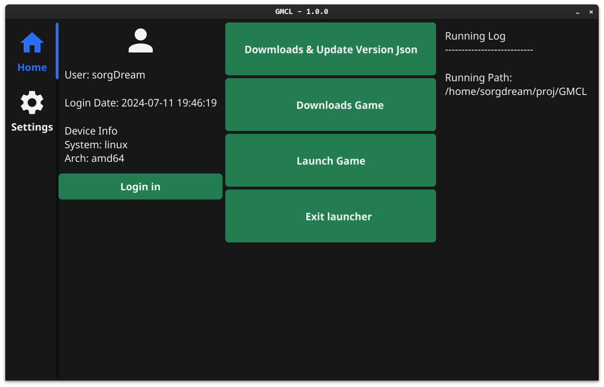

## GO-minecraft-launcher
一个使用``Go``编写的，适用于``*nix``的 Gui 离线我的世界启动器

## 开发进度
- [x] 用户登陆
- [x] 主题设置
- [x] 游戏主文件下载
- [x] 资源文件下载
- [x] Forge安装
- [ ] 依赖库文件下载
- [ ] natives库文件下载
- [ ] 启动脚本生成

## 截图


## 安装

### 使用预编译包
到[Releases](https://github.com/inuyasha-660/GMCL/releases)处选择版本并下载对应架构压缩包

``````bash
tar -zxvf go-mcl-[System]-[Arch]-[Version].tar.gz # 请根据实际替换[]及其内容
./go-mcl
``````

### 从源码安装

### 依赖安装
各系统所需的软件包请看[Getting Started](https://docs.fyne.io/started/)

### 编译
``````bash
git clone https://github.com/inuyasha-660/GMCL.git && cd GMCL
go mod tidy
go run . # 直接运行
go build . && ./go-mcl # 编译运行
``````