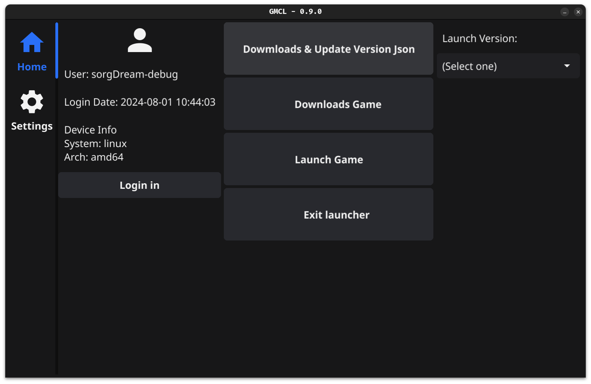

## GO-minecraft-launcher
一个使用``Go``编写的，适用于``*nix``的 Gui 离线我的世界启动器

## Features
- [x] 用户登陆
- [x] 主题设置
- [x] Mod loader支持(Forge)
- [x] 广泛的游戏版本可选
- [ ] 自定义启动参数

## 截图


**Text in GMCL is translated by Google.**

## 安装
``unzip``和``bash``将被用于解压/执行脚本，确保系统已安装并添加到``PATH``

### 使用预编译包
到[Releases](https://github.com/inuyasha-660/GMCL/releases)处选择版本并下载对应架构压缩包

``````bash
tar -zxvf go-mcl-[System]-[Arch]-[Version].tar.gz # 请根据实际替换[]及其内容
./go-mcl
``````

### 从源码安装

### 依赖安装
根据[Getting Started](https://docs.fyne.io/started/)安装相应依赖

### 编译
``````bash
git clone https://github.com/inuyasha-660/GMCL.git && cd GMCL
go mod tidy
go run . # 直接运行
go build . && ./go-mcl # 编译运行
``````